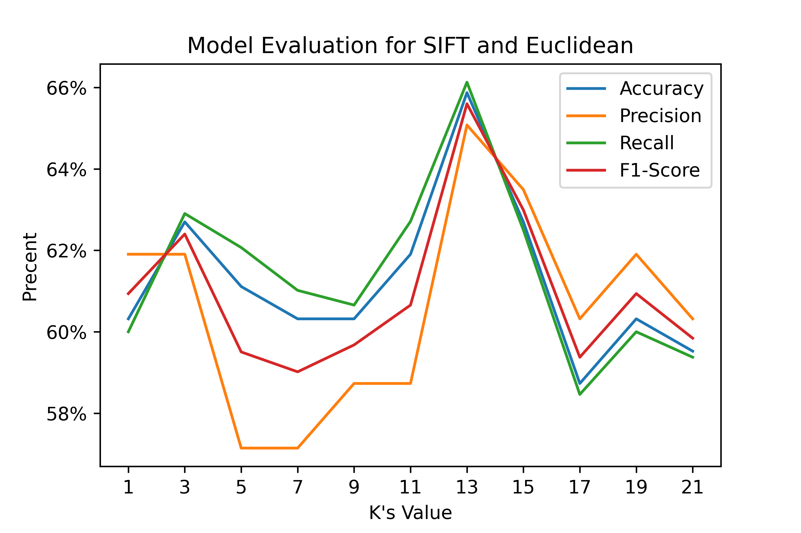
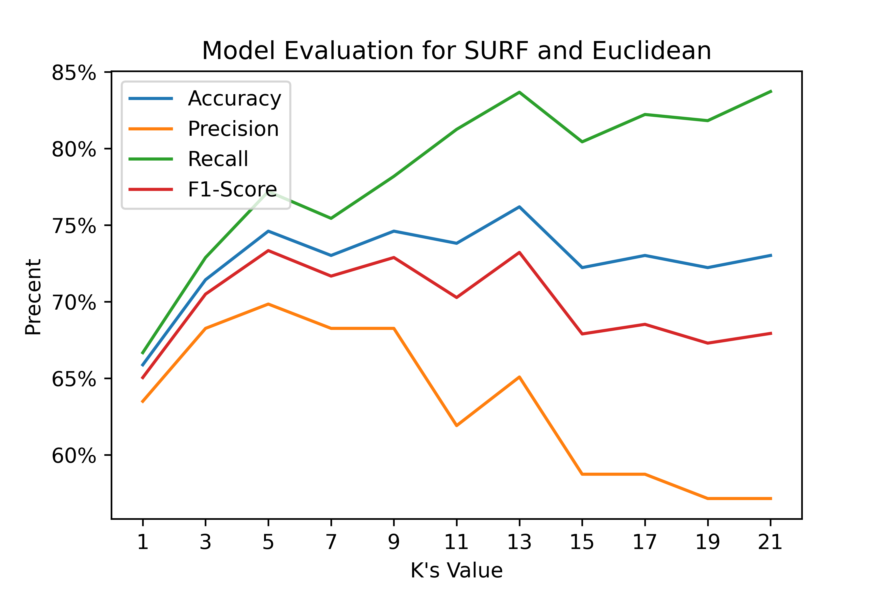
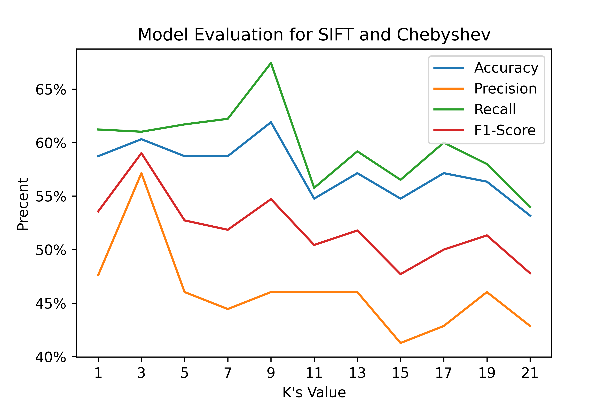
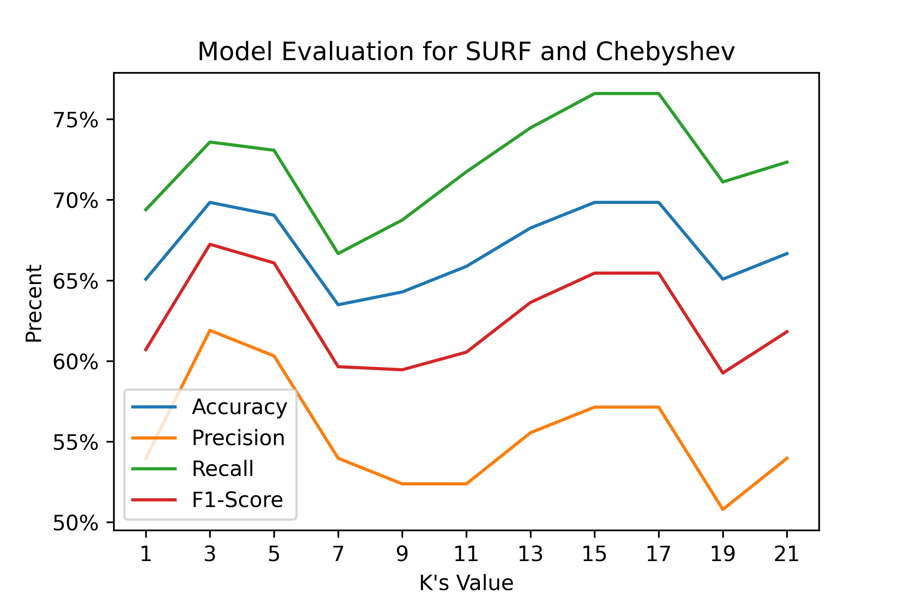
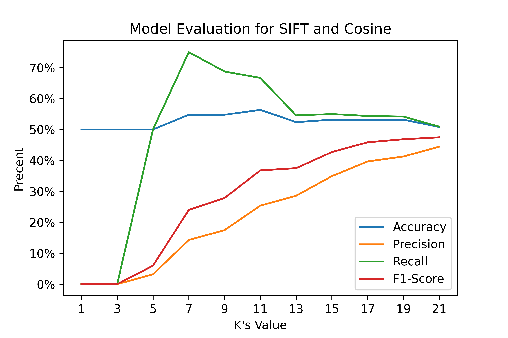

# Real_Time_Car_Recognication_Based_On_Bag_of_Visual_Words
 
---
In verification, we have 126 images, 63 for BMW, 63 for others.

| |SIFT|SURF|Time Cost(sec)|
|:-:|:-:|:-:|:-:|
|Manhattan  |    |  |1.420, 2.548|
|Euclidean  |    |  |1.887, 3.467|
|Chebyshev  |    |  |1.487, 2.662|
|Cosine     |       |     |4.176, 7.968|